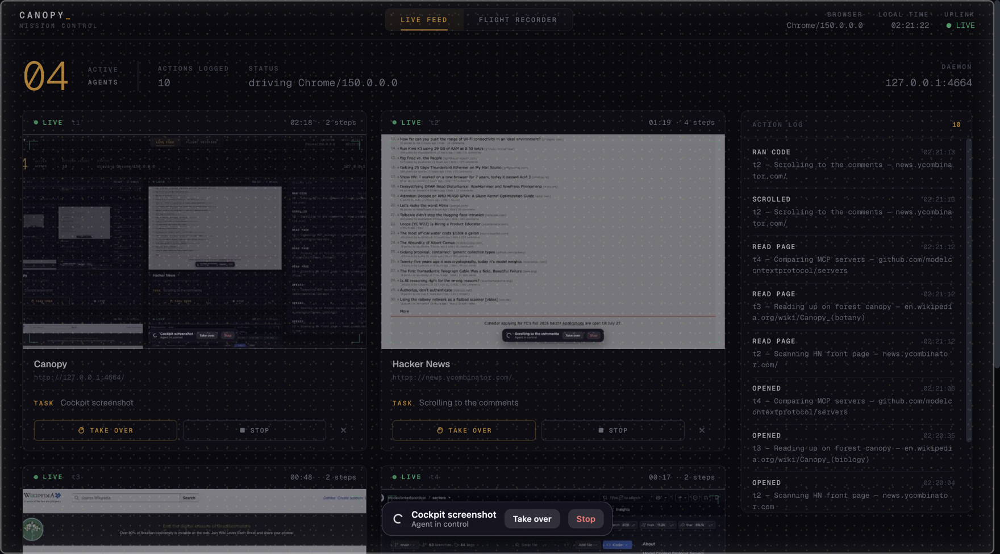
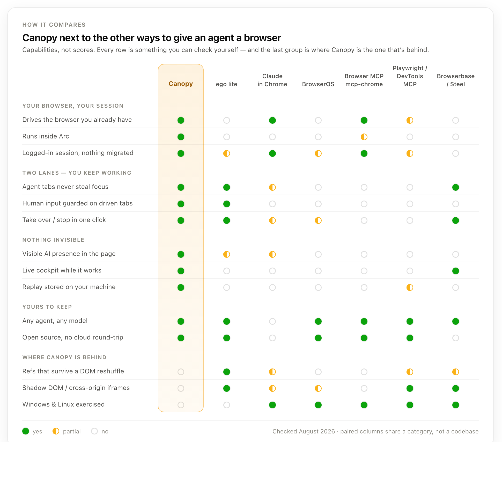
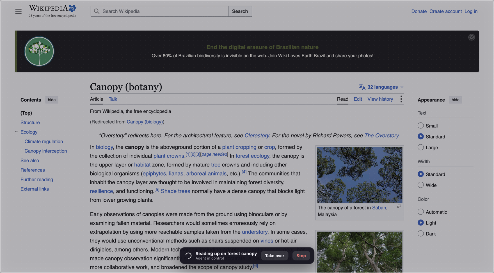
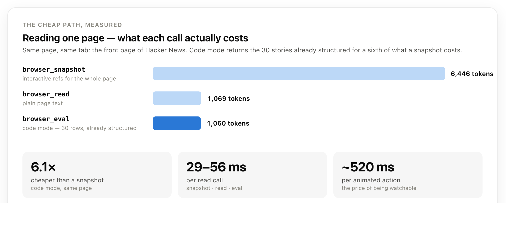

# Canopy

**Let AI agents drive the browser you already use — in their own tabs, next to yours, where you can watch every move.**

[](LICENSE)
[](https://nodejs.org)
[](https://modelcontextprotocol.io)

Canopy is a local daemon (MCP, speaking CDP or WebDriver BiDi) plus a browser extension. Agents
like Claude Code, Codex and Cursor open their own tabs in your real browser — with your logins —
while you keep working in yours. Every action shows a visible AI cursor on the page, streams to a
live cockpit, and is recorded frame by frame so you can replay it later.



## Why

Headless automation throws away the thing that makes browser agents useful: **your session**.
You are already logged into the admin panel, the CRM, the ticketing system. Canopy drives *that*
browser instead of a clean-room Chromium — and pays for the privilege with observability, because
an agent acting with your cookies is something you should be able to see and stop.

Three properties it is built around:

- **Two lanes.** Agent tabs open in the background and never steal focus. You are not handing
  over the machine — you are working alongside it.
- **Nothing invisible.** Driven tabs get a dimming veil with light flowing around its edge, a
  persistent "Agent in control" pill, an `AI ·` title prefix and a sparkle favicon. The cockpit
  mirrors it live.
- **Reversible.** Every driven tab has *Take over* and *Stop* one click away, in the page itself
  and in the cockpit.

## How it compares

<picture>
  <source media="(prefers-color-scheme: dark)" srcset="docs/compare-dark.png">
  
</picture>

The row nobody else fills is **your real browser, no CDP port**. Because the extension goes through
`chrome.debugger` instead of `--remote-debugging-port`, Canopy runs inside Arc — where
[Claude in Chrome](https://code.claude.com/docs/en/chrome) (Chrome only), Playwright MCP and
Chrome DevTools MCP do not go. The same goes the other way for the Firefox family: Canopy drives
Zen and Firefox over WebDriver BiDi, which the CDP-based tools cannot reach at all.

(The matrix image still shows Linux as a gap; it predates the Linux and Gecko support described
below and is due a redraw.)

The closest project in spirit is [ego lite](https://github.com/citrolabs/ego-lite), which reaches the
same two-lane conclusion from the other end: it ships its own browser and asks you to migrate into it,
and buys real things with that — refs that survive a DOM reshuffle, shadow-DOM and cross-origin iframe
reach, no "is being debugged" banner. Canopy is the other side of that trade: keep the browser you have,
accept a thinner page model. [BrowserOS](https://www.browseros.com/) forks Chromium for the same
independence; [Browserbase](https://www.browserbase.com/) and [Steel](https://steel.dev/) have the
observability but in a clean-room cloud browser, without your session.

And prompt injection is not going to be fixed — OpenAI has said as much, and independent tests of the
agentic browsers keep confirming it. If the attack has no patch, the honest mitigation is auditability:
watch it live, replay it after, both from your own disk. That is the column Canopy is actually built for.

<details>
<summary>Where these claims come from</summary>

- ego lite — [repo](https://github.com/citrolabs/ego-lite) · [site](https://lite.ego.app/) (MIT, macOS, Spaces, skill-based, no MCP, no replay)
- Claude in Chrome — [Claude Code docs](https://code.claude.com/docs/en/chrome) (Chrome only, side panel, own tab group, paid plans)
- BrowserOS — [site](https://www.browseros.com/) · [releases](https://github.com/browseros-ai/BrowserOS/releases) (Chromium fork, 11+ providers, local models)
- Browser MCP — [Chrome Web Store](https://chromewebstore.google.com/detail/browser-mcp-automate-your/bjfgambnhccakkhmkepdoekmckoijdlc) · Chrome MCP Server — [repo](https://github.com/hangwin/mcp-chrome)
- Chrome DevTools MCP — [announcement](https://developer.chrome.com/blog/chrome-devtools-mcp) · [focus-stealing issue](https://github.com/ChromeDevTools/chrome-devtools-mcp/issues/2290)
- Browserbase — [session live view](https://docs.browserbase.com/platform/browser/observability/session-live-view) · Steel — [comparison](https://steel.dev/blog/steel-vs-browserbase-a-practical-comparison)
- Prompt injection in agentic browsers — [AI browser security risks](https://research.aimultiple.com/ai-browser-security/)

Checked August 2026. Corrections welcome — open an issue if a row is wrong or has gone stale.
</details>

## Quick start

Requires Node ≥ 20. macOS and Linux are both exercised; Windows paths exist but are untested
(see [Limitations](#limitations)).

```bash
npx @arvoretech/canopy setup   # mints the token, registers the MCP server in Claude Code, installs the skill
npx @arvoretech/canopy         # starts the daemon
```

`setup` is idempotent; add `--launchd` (macOS) or `--systemd` (Linux) to also start the daemon at
login. If you don't use Claude Code, `setup` prints the equivalent `claude mcp add` command so you
can adapt it to your agent — the MCP endpoint is `http://127.0.0.1:4664/mcp` with
`Authorization: Bearer $(cat ~/.canopy/token)`. (Or from a clone: `pnpm install && node bin/canopy.js`.)

The daemon mints a token at `~/.canopy/token` on first run and requires it on every route and
socket (see [Security model](#security-model)). Then open the cockpit at
**http://127.0.0.1:4664/** and ask your agent to do something on a website.

If you use the browser extension, pair it once — run `canopy pair`, then paste the code into the
extension's **Details → Extension options**. The extension will not talk to an unpaired daemon,
which is what stops another local process from taking the bridge and, with it, the debugger on
every tab in your browser.

If the browser is closed when an agent asks for a tab, the daemon launches it in the background
and waits for the bridge to come up — no manual step. It looks for a Chromium browser first (Arc,
Chrome, Chromium, Brave, Edge — binaries, macOS bundles and Flatpaks), then for a Gecko one.

The same binary is also a small CLI against a running daemon:

```bash
canopy setup                 # one-shot install: token, Claude Code MCP + skill (--launchd/--systemd: start at login)
canopy pair                  # print the code that pairs the browser extension
canopy status                # connected browser + open agent tabs
canopy open https://example.com --label "checking something"
canopy tabs
canopy screenshot t1 out.png
canopy close t1
```

The daemon reaches a browser three ways and accepts all of them at once. When the extension is
connected it wins, because only that path can group tabs and work without a debugging port.

### Option A — a dedicated test browser

Branded Chrome 137+ ignores `--load-extension`, so the dev browser is Chrome for Testing:

```bash
pnpm dlx @puppeteer/browsers install chrome@stable --path ~/.canopy/browsers   # once
node bin/canopy.js --launch-chrome
```

This launches in the background (`open -g` on macOS, so it does not steal focus) with the extension
loaded and a separate profile under `~/.canopy/chrome-profile`. Best for trying Canopy out without
pointing it at your logged-in session.

### Option B — your real Chromium browser (Arc, Chrome, Brave, Edge)

1. Go to `arc://extensions` (or `chrome://extensions`) → enable **Developer mode** → **Load unpacked** → pick `extension/`
   (a Chrome Web Store listing is in review — see [docs/chrome-web-store.md](docs/chrome-web-store.md))
2. The extension badge reads `on` once it reaches the daemon.
3. That's it. Agents now drive your real browser through `chrome.debugger` — no
   `--remote-debugging-port`, no separate profile, your logins intact.

The extension path is the interesting one: because it uses `chrome.debugger` rather than a CDP
port, it works in browsers that never expose one — which is how Canopy runs inside Arc.

### Option C — Firefox, Zen, LibreWolf, Floorp

Gecko has no `chrome.debugger` and no CDP: Mozilla removed its CDP implementation in favour of
[WebDriver BiDi](https://w3c.github.io/webdriver-bidi/), so `--remote-debugging-port` on Firefox
opens a BiDi socket and nothing else. Canopy speaks it — same tools, same cockpit, same overlay:

```bash
canopy --launch-firefox                  # a throwaway profile under ~/.canopy/firefox-profile
canopy --launch-firefox --real-profile   # your own profile, with your logins
canopy --launch-firefox --browser /path/to/zen
```

Or start the browser yourself and just run the daemon — `zen --remote-debugging-port=9223`,
`flatpak run app.zen_browser.zen --remote-debugging-port=9223`. The port is discovered on
`ws://127.0.0.1:9223/session` (`--bidi-port`, `CANOPY_BIDI_URL`).

Two things to know, both of them Gecko's:

- **The remote agent only starts at launch.** A browser that is already running on that profile
  takes the arguments, hands them to the running copy and exits, and the port never opens. Quit it
  first — that is what `--real-profile` prints a reminder about.
- **One session, and it outlives its socket.** Gecko allows a single WebDriver session per browser
  and will not hand a stale one back, so Canopy ends its session on shutdown. If something else
  took it (or a daemon was killed), the daemon says so and the fix is to restart the browser.

What is missing compared to Chromium: no tab groups, no response bodies (BiDi does not expose them
— read them with `browser_eval` and `fetch`), and no debugging banner either, which is a small win.

## What you see while an agent works

Agent tabs are grouped into an amber **AI** tab group, titled `AI · <page title>`, with a sparkle
favicon. On the page itself: a frosted veil with a slowly drifting dot lattice, an aurora of warm
light breathing along the viewport edges, the AI cursor visible the whole time the agent owns the
tab (not just during actions), and a pill naming the current task:



While the agent owns a tab, **human input on that page is blocked** — clicks and keystrokes are
swallowed so you can read over the agent's shoulder without fighting it for the cursor. The pill's
*Take over* and *Stop* buttons stay clickable, and they are how control changes hands:

- **Take over** — the agent's next tool call on that tab fails with an explicit "the user took
  over" error, telling it to stop and check in with you.
- **Stop** — same, but signals you want the whole task halted.
- Hand control back from the cockpit whenever you want.

Merely *focusing* an agent tab does not pause it. That is deliberate: the input guard already
makes watching safe, so control only moves when you actually ask for it.

## MCP tools

| Tool | What it does |
|---|---|
| `browser_status` | Connected browser, sessions, open agent tabs, cockpit URL. Call it first. |
| `session_start` / `session_end` | One named session per task — its own tab group and its own recording. |
| `browser_open` | Open a background tab; returns its id plus a snapshot with `[ref]` numbers. |
| `browser_tabs` | List the agent's tabs (never yours). |
| `browser_navigate` | Navigate an existing tab. |
| `browser_snapshot` | Interactive elements as numbered refs — the cheap alternative to screenshots. |
| `browser_act` | `click` · `fill` · `press` · `scroll`, each with the animated cursor and keystroke HUD. Refuses hidden or covered refs, and reports what changed. |
| `browser_read` | Page text. |
| `browser_eval` | Run JS in the page — *code mode*, see below. |
| `browser_wait` | Wait `until` a selector, text, JS expression or `load`. |
| `browser_screenshot` | PNG at 1:1 with CSS pixels, so coordinates read off it are valid click targets. |
| `browser_console` | Console errors, uncaught exceptions and failed/4xx-5xx requests — why a page "just does nothing". |
| `browser_resize` | Emulate a viewport (`phone` · `tablet` · `desktop` · `wide`, or explicit size) without touching the user's window. |
| `browser_requests` / `browser_request_body` | Inspect the XHR/Fetch the page made, and their responses. |
| `browser_close` | Close a tab. |

A REST mirror of the same surface lives on the daemon (`/status`, `/tabs`, `/tabs/:id/act`, …) if
you would rather drive it with `curl`. `skills/canopy/` packages the usage patterns below as a
Claude Code skill.

### Failures are not silent

The expensive failure mode in browser automation is not the error — it is the step that returns
successfully and does nothing. A dead API host behind a swallowed `catch`, a click that lands on a
modal still hidden in its portal, a 401 that leaves the page exactly as it was. The agent moves on,
and finds out ten steps later. So Canopy makes each of those visible at the moment it happens:

- Console errors, uncaught exceptions and failed or 4xx/5xx requests are captured per tab and
  **injected into every snapshot and every action result** as a `⚠` block — no extra call needed.
  `browser_console` has the full log.
- A navigation that never resolved is reported as `⚠ THE PAGE DID NOT LOAD: net::ERR_NAME_NOT_RESOLVED`
  instead of a clean snapshot of Chrome's error page.
- Snapshots omit elements that are not really on screen — inside `aria-hidden`, `inert`, a
  zero-opacity wrapper — and `browser_act` refuses a ref that is hidden or covered, naming whatever
  sits on top of it.
- Every action returns an `after:` line (`text changed`, `interactive elements 4 -> 6`,
  or `NO CHANGE DETECTED`), so "the click worked" is an observation rather than an assumption.

## The cheap path: code mode and API mining

Clicking through a UI burns tokens — a snapshot per step, a screenshot when you are unsure. Two
patterns are roughly an order of magnitude cheaper, and Canopy is shaped to make them easy.

<picture>
  <source media="(prefers-color-scheme: dark)" srcset="docs/cost-dark.png">
  
</picture>

**Code mode** — one `browser_eval` replaces ten `browser_act`s:

```js
(async () => {
  const rows = [...document.querySelectorAll('tr.item')]
  return rows.map(r => ({
    name: r.querySelector('.name')?.innerText,
    price: r.querySelector('.price')?.innerText
  }))
})()
```

**API mining** — the page is already talking to an API with your cookies. So: do the UI action
*once*, find the call it triggered, then skip the UI entirely.

1. `browser_requests { tab, filter: "api" }` — what XHR/Fetch did this page make?
2. `browser_request_body { tab, request }` — what does the response look like?
3. `browser_eval` with `fetch(url, { credentials: 'include', … })` — same session, no clicks.

For anything repetitive — pagination, bulk edits, polling a job — this turns a 40-step click
sequence into one request. Canopy enables `Network` on `about:blank` *before* the real
navigation, so the page's very first API calls are captured too.

## Architecture

| Piece | Role |
|---|---|
| `src/daemon.js` | HTTP on `127.0.0.1:4664`: cockpit `/`, MCP `/mcp`, REST, WebSockets `/ws` (cockpit) and `/ext` (extension) |
| `src/core.js` | Sessions, tabs, actions with the animated cursor, ref snapshots, network capture, screencast |
| `src/cdp/*` | Three interchangeable transports: a direct CDP port, a bridge through the extension, and WebDriver BiDi for Gecko |
| `src/overlay.js` | In-page presence: veil, pill, AI cursor, keystroke HUD, title and favicon badging |
| `src/snapshot.js` | DOM → numbered interactive refs (password values are never captured) |
| `src/launch.js` | Finding and starting a browser: macOS bundles, Linux binaries and Flatpaks, Windows paths |
| `src/recorder.js` | Append-only action log + JPEG frames per session |
| `extension/` | MV3 service worker: tab lifecycle, CDP without a port |
| `cockpit/` | Live Feed (tiles + action log) and Flight Recorder (scrubbable replay) |

Screencast only runs while someone is actually watching the cockpit; otherwise frames are sampled
sparsely, because `captureScreenshot` on N tabs is the one real background CPU cost.

## Recordings and replay

Every session writes to `~/.canopy/sessions/<id>/` — a JSONL action log plus JPEG frames. They are
plain files: grep them, diff them, delete them. The cockpit's **Flight Recorder** tab replays a
session on a scrubbable timeline, filterable by tab, so "what did the agent actually do at 14:32"
has an answer.

## Cloud mode

Everything above runs against the browser on your machine. Cloud mode runs the *same* daemon
next to a headless Chromium in a container — a self-hosted [Browserbase](https://browserbase.com)-style
browser-in-the-cloud, with the cockpit, the flight recorder and the MCP/REST surface included:

```bash
docker build -t canopy .
docker run -d -p 4664:4664 \
  -e CANOPY_TOKEN=$(openssl rand -hex 24) \
  -e CANOPY_PUBLIC_HOST=canopy.example.com \
  -v canopy-data:/data \
  canopy
```

(or start from [docker-compose.cloud.yml](docker-compose.cloud.yml)). Point a TLS-terminating
reverse proxy at port 4664 and connect agents to `https://canopy.example.com/mcp` with
`Authorization: Bearer <token>`. Humans open the cockpit once as `/?token=<token>`: the daemon
sets an `HttpOnly; Secure; SameSite=Strict` cookie and redirects, so the token leaves the URL and
never becomes readable by page JavaScript.

What changes when the bind leaves loopback:

- **Everything requires the token** — REST, `/mcp`, the cockpit WebSocket (it carries frames and
  accepts takeover/stop), recordings and replays. Only the static cockpit shell is served open.
  The daemon refuses to start public with `CANOPY_NO_AUTH=1`.
- **The Host allowlist replaces the loopback guard** — requests whose `Host` is not in
  `CANOPY_PUBLIC_HOST` are refused.
- **The Chromium profile lives on the `/data` volume**, so logins the agent performs survive
  restarts and redeploys — the cloud equivalent of "the browser you are already logged into".
- **Private networks are off limits** — RFC1918, loopback, link-local (`169.254.169.254`) and bare
  single-label hostnames are refused. This is a guardrail against an agent wandering, not a
  boundary against the token holder: it applies to `openTab`/`navigate`, so `browser_eval` can
  navigate around it, a redirect lands after the check, and a public name that *resolves* into
  private space is never caught. Egress filtering in front of the container is the real control.

| Env | What it does |
|---|---|
| `CANOPY_BIND` | Listen address. Default `127.0.0.1`; the Docker image sets `0.0.0.0`. |
| `CANOPY_PUBLIC_HOST` | Comma-separated Host allowlist (your public hostnames). |
| `CANOPY_TOKEN` | Sets the API token explicitly (otherwise minted at `$CANOPY_DATA_DIR/token`). |
| `CANOPY_DATA_DIR` | Data dir (token, sessions, profile). The image sets `/data`. |
| `CANOPY_SSO_HOST` | Host whose requests arrive through your proxy's forward-auth (e.g. oauth2-proxy). On that host — and only there — a request carrying `CANOPY_SSO_HEADER` **and** `CANOPY_SSO_SECRET` counts as authenticated, so SSO'd humans get the cockpit with no token. |
| `CANOPY_SSO_SECRET` | **Required for SSO to work at all.** Your proxy must inject it as `X-Canopy-SSO-Secret`. Without it Canopy ignores `CANOPY_SSO_HOST` entirely — see the note below. |
| `CANOPY_SSO_HEADER` | The identity header your forward-auth sets. Default `x-auth-request-email`. Only trust this if the middleware *overwrites* it (oauth2-proxy with `authResponseHeaders` does). |
| `CANOPY_ALLOW_SCHEMES` | Extra URL schemes agents may navigate to, comma-separated. Default allows `http:`/`https:` only. |
| `CANOPY_MCP_ORIGIN` | Origin the cockpit displays in its "connect an agent" command (useful when agents use a separate token-auth domain next to an SSO-protected cockpit domain). |
| `CANOPY_CDP_URL` | Where the browser's CDP endpoint lives. Default `http://127.0.0.1:9222` (the in-container Chromium). |

A practical two-domain setup: `canopy.example.com` → cockpit behind your SSO middleware
(`CANOPY_SSO_HOST`), and `canopy-mcp.example.com` → token-only, for agents that can't do OAuth.
Both point at the same container.

SSO is only as good as the guarantee that requests really came through your proxy, and Host-based
routing alone does not give that guarantee for traffic that never passes the proxy. So Canopy also
requires `CANOPY_SSO_SECRET`, a value only your proxy knows and injects. Set `CANOPY_SSO_HOST`
without it and Canopy logs a warning and keeps SSO off, leaving the token as the only way in.

One container is one browser (sessions are tab groups inside it) — multi-tenant means one
container per tenant, each with its own token, volume and hostname.

## Security model

Canopy deliberately gives an agent a lot: a browser holding your live sessions. Please read this
section before pointing it at a profile that matters.

What the design gives you:

- **Token auth on everything.** The daemon mints a random token at `~/.canopy/token` (mode `0600`)
  on first run and requires it on every route and both WebSockets — the sole exception is the
  cockpit shell at `/`, which carries no data. Loopback is not a security boundary — any local
  process can reach `127.0.0.1` — so control of your logged-in browser, *and the recordings of
  it*, are gated on being able to read that file. `CANOPY_NO_AUTH=1` opts out locally and is
  refused outright on a non-loopback bind.
- **The cockpit holds no credential.** It gets the token as an `HttpOnly; SameSite=Strict` cookie:
  unreadable from page JavaScript, absent from the URL and from proxy logs. Because `SameSite`
  ignores ports — any other service on `127.0.0.1` is "same site" — the cookie is only honoured on
  requests the browser labels as coming from our own origin, and never for a write without a
  matching `Origin`.
- **No CORS, Host and Origin validated.** REST responses carry no `Access-Control-Allow-Origin`,
  and a non-loopback `Host` is refused (DNS-rebinding guard). WebSockets are exempt from CORS, so
  `/ws` also requires that any `Origin` present match the `Host` — that is what stops a page you
  have open from dialing `127.0.0.1` and subscribing to the live frames of every agent tab.
- **The extension bridge is paired.** Extension and daemon prove a shared secret to each other
  (HMAC over a nonce; the secret never crosses the wire), so no web page and no port-squatting
  local process can pose as either. Pair once with `canopy pair`.
- **`http(s)` only.** `file:`, `chrome:`, `devtools:` and `view-source:` are refused, so a
  navigation cannot turn into a file read. `CANOPY_ALLOW_SCHEMES=file:` opts back in.
- **Loopback only by default.** Nothing listens on a routable interface unless you explicitly
  enable [cloud mode](#cloud-mode) — and there, private and link-local destinations are blocked
  too, so the browser cannot be used as an SSRF pivot into the network it sits in.
- **Your data stays local.** Recordings are files in your home directory. Canopy ships no
  telemetry and talks to no server of ours. Treat recordings as screenshots of whatever the agent
  saw — because that is what they are.
- **Passwords are skipped.** `browser_snapshot` records the value of every field except
  `type="password"` — so a one-time code typed into an ordinary text field *does* land in the
  snapshot and the action log.
- **Visible by construction.** An agent cannot drive a tab without the veil, the pill, the marked
  title and the cockpit tile. There is no silent mode, on purpose.
- **Prompt injection is the real risk.** An agent reading a page with your cookies can be
  instructed *by that page*. Nothing here prevents that. The live cockpit and the replay are the
  mitigation — watch what happens, and use a dedicated profile for anything sensitive.

The extension requests `debugger` and `<all_urls>`, which is the maximum a Chrome extension can
ask for. That is inherent to the goal — driving arbitrary pages in a browser that exposes no CDP
port — and it is why the extension is loaded unpacked from source you can read (~200 lines)
rather than shipped through the Web Store.

[Cloud mode](#cloud-mode) is a different risk posture and worth naming as such: one static token
with no rotation or per-user identity, and a container whose Chromium runs `--no-sandbox`, sitting
next to a logged-in profile on a volume. If you point `CANOPY_SSO_HOST` at an SSO-protected
hostname you **must** also set `CANOPY_SSO_SECRET` — see [SECURITY.md](SECURITY.md).

Found a vulnerability? See [SECURITY.md](SECURITY.md).

## Project status

Early, honest about it: `0.1.0`, one contributor, built on top of an earlier Electron prototype
and ported to this two-lane architecture.

**Works and is exercised:** the MCP and REST surfaces, both transports, the overlay and input
guard, network capture and replay of API calls, session recording, multi-tab replay filtering,
the cockpit's live feed, token auth, the CLI. Exercised end-to-end inside Arc (open, navigate,
act, background-tab keyboard, screenshots) and against Chrome for Testing.

Two reliability details worth knowing: the daemon pings the extension every 20 s because MV3
service workers idle out after ~30 s and would otherwise drop the bridge; and agent tabs survive
short bridge drops (60 s grace) while tabs left over from a *dead* daemon are swept closed on
reconnect (the extension remembers them in `chrome.storage.session`).

**Known-thin, help welcome:**

- Tab grouping in Arc returns `-1`; Arc may not render Chrome tab groups at all (degrades cleanly).
- The Windows launcher paths are written but nobody has run them.
- No Web Store package yet — `dist/canopy-extension.zip` is built, publishing is pending.

## Limitations

- **macOS and Linux are tested; Windows is not.** The launcher carries Windows paths but nobody
  has run them.
- Background tabs cannot screencast, so their feed falls back to ~1.5 s polling. Foreground tabs stream smoothly.
- In extension mode Chrome shows its "is being debugged" banner. That is the cost of driving a
  real browser without a CDP port.
- On Gecko there is no screencast at all, so every tab uses the polled feed; response bodies are
  not available; and an agent tab that has never been selected has no layout of its own, so it is
  given a 1280×800 viewport until `browser_resize` or a take-over says otherwise.
- Snapshots cap at ~180 elements (form fields always included). Long pages: scroll and re-snapshot, or go code mode.
- **Every action costs ~520 ms** — cursor travel and settle time, so a human can follow along. A raw
  CDP click is ~10× faster. That is the price of the overlay, and the reason long repetitive runs
  belong in code mode rather than in `browser_act`. The post-action change check adds ~250 ms on top;
  `verify: false` buys it back for steps whose effect you are about to read anyway.
- Refs are positional: reshuffle the DOM between a snapshot and an act and the ref can go stale.
  Shadow DOM and cross-origin iframes are not reachable yet.

## Contributing

Issues and PRs welcome — see [CONTRIBUTING.md](CONTRIBUTING.md). The security items above are the
most useful place to start.

## License

MIT © Árvore Educação. See [LICENSE](LICENSE).
