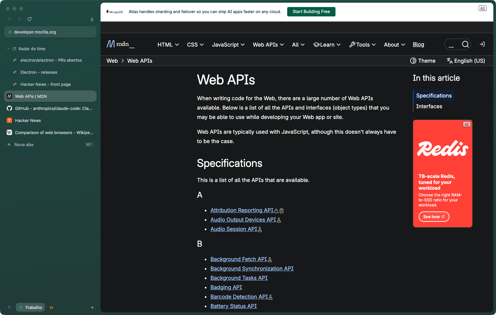
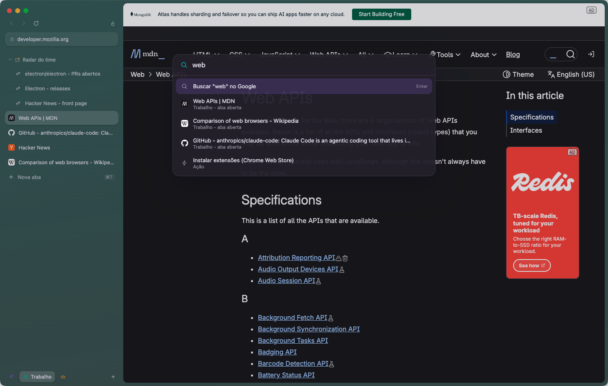
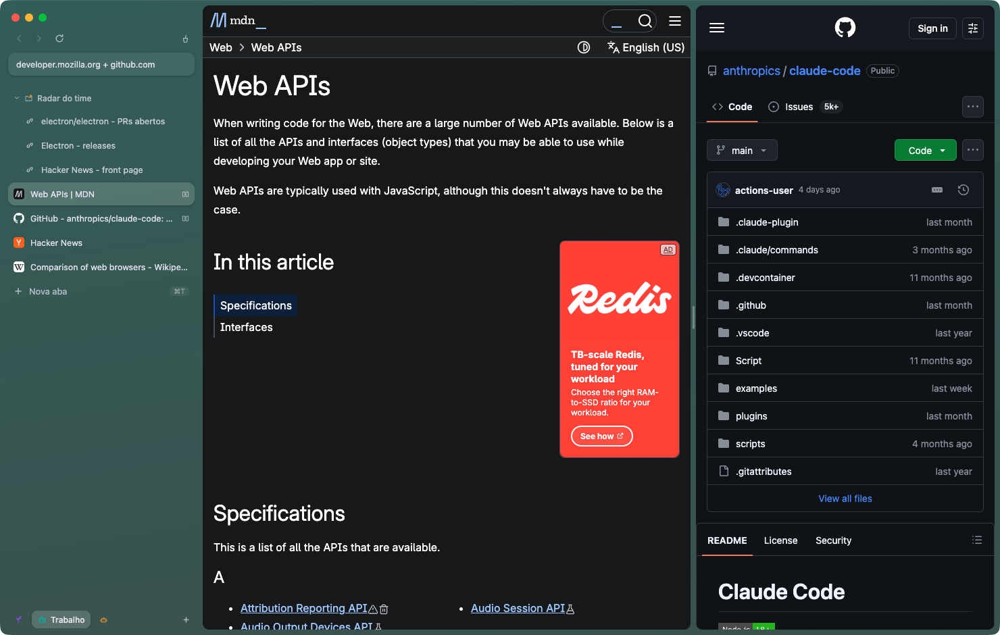
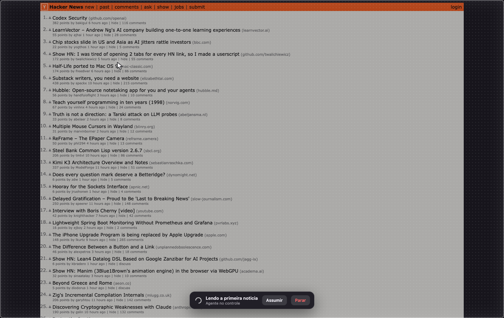
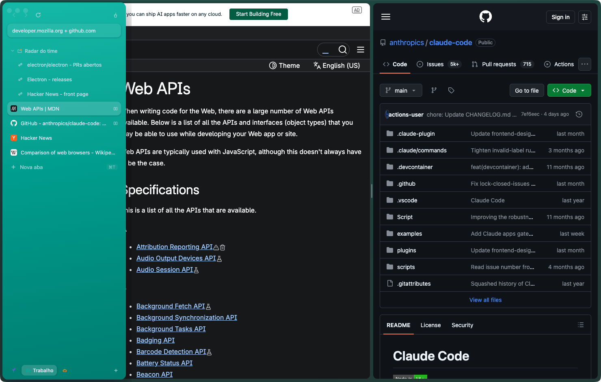

# Galho

[](https://github.com/arvoreeducacao/galho/actions/workflows/ci.yml)
[](LICENSE)

Arc-inspired, agent-native browser built on Electron (real Chromium engine). Colored glass sidebar, spaces, command palette with site search, resizable split view, folders (including live folders), Chrome Web Store extensions, find in page, auto-archive — and CDP plus a high-level HTTP agent API built in, with a visible takeover overlay so you always know when an agent is driving.

Documentação em português: [README.pt-BR.md](README.pt-BR.md)

## Screenshots

| | |
|---|---|
|  |  |
|  |  |



## Running

```bash
pnpm install
pnpm start          # dev
pnpm dist           # builds Galho.app + DMG (macOS) into dist/
```

Global CLI:

```bash
pnpm link --global  # installs the `galho` command
galho               # opens (or focuses) the browser
galho open github.com
```

The persistent profile (cookies, logins, localStorage) lives in `~/Library/Application Support/Galho` on macOS. Log in to Google, Slack etc. once and the session sticks. The user agent matches a regular Chrome, so Google login works.

Set `GALHO_PROFILE=/path/to/profile` to run an isolated instance (useful for tests and demos).

The UI is in English by default and switches to Portuguese (pt-BR) when the system locale is `pt`. `GALHO_LANG` overrides the detection.

Galho registers itself as a handler for `http`/`https`, so you can set it as the default browser — links clicked in other apps open as tabs in the focused window.

## Concepts

- **Spaces**: groups of tabs with their own color and icon. The whole sidebar is glass tinted by the active space's color (real vibrancy on macOS). Right-click the pill to rename, change icon or color, clean, or delete. The **Agentes** space is created automatically when an agent opens a tab through the API — the agent works there without stealing your focus, reusing your logged-in session.
- **No new tab page**: `Cmd+T` opens the command palette, like Arc. An empty space shows only the background.
- **Favorites**: `Cmd+D` pins the tab as a tile in the grid at the top of the sidebar.
- **Folders**: right-click a tab > Move to folder. Dragging a tab onto a folder also works. **Live folders** are folders fed by a script or agent through the API (for example, your open PRs) — they show an orange dot.
- **Split view**: `Cmd+Shift+D` (or right-click a tab > Open in split view). Two tabs side by side, with a **draggable divider** to resize the panes and a palette action to swap sides.
- **Archive, not close**: `Cmd+W` archives (recoverable from the palette > "View archived tabs"). Idle tabs are archived automatically (Arc style) — 12h by default, configurable per space (24h, 7 days, or never) via right-click on the space pill. The broom button or `Cmd+Shift+K` cleans the whole space (except favorites).
- **Command palette** (`Cmd+T`): fuzzy search across open tabs, history (frecency), archived tabs, browser actions, direct URLs, or Google search. `Cmd+L` opens it in "open here" mode. **Site search** prefixes jump straight to a site's search: `g` (Google), `yt` (YouTube), `gh` (GitHub), `npm`, `wiki` (Wikipedia), `mdn` (MDN), `maps` (Google Maps), `gpt` (ChatGPT) — e.g. `gh split view`.
- **Sidebar peek**: `Cmd+S` hides the sidebar (animated). While hidden, hovering the left edge peeks it over the page as a floating panel — no relayout.
- **Chrome extensions**: install straight from the Chrome Web Store (palette action "Install extensions", or `POST /extensions` with the store id). Dark Reader is validated end to end. Extension browser actions show up in the sidebar and extension items in the page context menu. Powered by `electron-chrome-extensions`.
- **Downloads**: silent — files go to `~/Downloads` (deduplicated names), no dialog. `GET /downloads` lists them; the palette has an "Open downloads folder" action.
- **Boosts**: per-host CSS/JS injected on every page of that host, managed through the API (`PUT /boosts/:host`) — Arc-style boosts for agents and scripts.

## Shortcuts

| Shortcut | Action |
|---|---|
| `Cmd+T` | Command palette (new tab) |
| `Cmd+L` | Palette in URL mode (navigates the current tab) |
| `Cmd+W` | Archive tab |
| `Cmd+Shift+T` | Reopen closed tab |
| `Cmd+D` | Pin/unpin favorite |
| `Cmd+F` | Find in page |
| `Cmd+Shift+D` | Split view (drag the divider to resize) |
| `Cmd+Shift+P` | Picture-in-Picture |
| `Cmd+Shift+K` | Clean space tabs |
| `Cmd+N` | New window |
| `Cmd+Ctrl+N` | New space |
| `Cmd+S` | Show/hide sidebar (hover the left edge to peek) |
| `Cmd+R` / `Cmd+Shift+R` | Reload / reload without cache |
| `Cmd+[` / `Cmd+]` | Back / forward |
| `Ctrl+Tab` / `Ctrl+Shift+Tab` | Next / previous tab |
| `Cmd+1..9` | Tab by index (9 = last) |
| `Ctrl+1..9` | Space by index |
| `Cmd+Alt+Left/Right` | Previous / next space |
| `Cmd+Shift+C` | Copy URL |
| `Cmd+Alt+I` | Tab DevTools |

Double-click renames a space or folder. Middle-click archives a tab. Dragging reorders and moves into folders.

## Performance

Measured on a MacBook M2, 16 GB RAM — median of 3 runs, 2026-07-28/29. "Packaged" is a real `electron-builder` build; RSS is the aggregate of all processes as reported by `ps` (double-counts shared pages, but it is the same metric used for the baselines, so it is comparable across apps).

```
Cold start (packaged)   API ready    ██████░░░░░░  316 ms
                        first paint  █████████░░░  ~0.5 s
```

| Metric | Value | Context |
|---|---:|---|
| Cold start → agent API responding | **316 ms** | 355 ms in dev mode |
| Cold start → first paint | **~0.5 s** | first run of a fresh build pays 2-3 s once (Gatekeeper) |
| `POST /tabs` (open a tab) | **~12 ms** | page load after that is the site's time, not Galho's |
| `GET /tabs` | **< 1 ms** | with 10 tabs open |
| Tab screenshot (active tab) | **~28 ms** | background tabs currently ~480 ms |
| Memory, 0 tabs | **235 MB** | 3 processes |
| Memory per tab, heavy sites | **~250 MB** | ad-heavy news portals; docs and light pages far less |

The per-tab cost is dominated by Chromium's site isolation: every cross-origin iframe (mostly ads) gets its own process, so 15 news tabs can mean 70+ processes. That is the engine, not the shell — for reference, on the same machine Arc was sitting at **~3.5 GB across 21 processes** with a regular session. An ad blocker installed through the extension support flattens that curve more than anything else.

## CLI

```
galho                          opens (or focuses) the browser
galho open <url> [-s space] [-f]   opens a tab (default: Agentes space, unfocused)
galho tabs / spaces            lists
galho shot <id> [-o out.png]   tab screenshot
galho text <id>                page innerText
galho eval <id> <expr>         runs JS in the page
galho click <id> <x> <y>       clicks with the agent overlay visible
galho type <id> <text>         types (real keyboard events)
galho press <id> <key>         Return, Tab, Escape...
galho close <id>               closes the tab
galho folder <space> <name> <links.json>   creates/updates a live folder
```

## Agent integration

The primary transport is a **unix domain socket** at `<userData>/agent.sock` (macOS: `~/Library/Application Support/Galho/agent.sock`), mode `0600` — only your user can talk to it, no token needed. A TCP listener on `127.0.0.1:9224` (`GALHO_API_PORT`) is also available but requires a bearer token from `<userData>/agent-token`.

When an agent acts on a tab (click/type/navigate/eval), the page shows a monochrome takeover overlay: a **mouse-arrow cursor** that moves to each action, a **dotted veil** over the page, and a pill saying **"Agent is in control"** (with the action label, when given) plus **Take over** and **Stop** buttons — so a human can always interrupt. The tab also gets a pulsing badge in the sidebar. Screenshots work for background tabs and with the screen locked.

```bash
SOCK=~/Library/Application\ Support/Galho/agent.sock
curl --unix-socket "$SOCK" http://galho/          # manifest + endpoints
curl --unix-socket "$SOCK" -X POST http://galho/tabs -d '{"url":"https://mail.google.com"}'
curl --unix-socket "$SOCK" http://galho/tabs/ID/screenshot -o shot.png
curl --unix-socket "$SOCK" -X POST http://galho/tabs/ID/click -d '{"x":500,"y":300,"label":"Opening inbox"}'
curl --unix-socket "$SOCK" -X POST http://galho/tabs/ID/type -d '{"text":"hello"}'
curl --unix-socket "$SOCK" -X POST http://galho/folders -d '{"space":"Work","name":"PRs","links":[{"title":"...","url":"..."}]}'
curl --unix-socket "$SOCK" -X PUT http://galho/boosts/github.com -d '{"css":"header { display: none }"}'
curl --unix-socket "$SOCK" http://galho/extensions
curl --unix-socket "$SOCK" http://galho/downloads
```

Over TCP (for clients that cannot use unix sockets):

```bash
TOKEN=$(cat ~/Library/Application\ Support/Galho/agent-token)
curl -H "Authorization: Bearer $TOKEN" http://127.0.0.1:9224/tabs
```

**CDP is off by default.** Launch with `GALHO_CDP=1` (or an explicit `GALHO_CDP_PORT`) to expose full Chrome DevTools Protocol on `127.0.0.1:9223`. With CDP on, `GET /tabs` includes `targetId`/`cdpUrl` per tab, and Playwright works:

```js
const { chromium } = require('playwright')
const browser = await chromium.connectOverCDP('http://127.0.0.1:9223')
```

### Security

Goal: **no unauthenticated local surface**. A browser holds your logged-in sessions; a plain localhost port is reachable by any process running as any user on the machine, so it would let any local app or malware drive the browser.

- **Unix socket, mode 0600** — filesystem permissions are the authentication (same model as `docker.sock`). This is the default and preferred transport.
- **TCP requires a bearer token** — random per install, stored at `<userData>/agent-token` (mode 0600). Requests without it get `401`.
- **CDP is opt-in** — the DevTools protocol has no authentication at all, so the port simply does not exist unless you launch with `GALHO_CDP=1`. The high-level API (click/type/eval/screenshot) does not depend on it.

Do not expose any of these to the network. The sidebar and window chrome are out of reach of web pages (separate WebContentsView) — a page cannot spoof the browser UI.

## Distribution

`pnpm dist` produces `dist/Galho-<version>-arm64.dmg` and `.zip` (macOS). `pnpm dist:win` / `pnpm dist:linux` produce an NSIS installer / AppImage+deb (preferably run in CI or on the target platform). No signing/notarization yet — the first open requires right-click > Open on macOS.

## Architecture

```
src/
  main.js               windows (multi-window), session (Chrome UA), IPC, permissions,
                        downloads, boosts, sidebar peek, default-browser URLs
  tab-manager.js        spaces, tabs, folders, split (ratio + swap), archive,
                        one WebContentsView per tab
  palette-controller.js command palette (transparent overlay) + actions + modes + site search
  find-controller.js    find in page bar
  agent-api.js          agent API (unix socket + TCP with token) + takeover overlay
  menu.js               native menu + shortcuts
  state.js              debounced JSON persistence
  i18n.js               strings (en / pt-BR)
  preload.js            IPC bridge with channel whitelist
ui/
  index.html/app.js/style.css   sidebar (glass tinted by space color; also renders the peek)
  palette.html/palette.js       command palette
  findbar.html                  find in page bar
  drag.html                     split-divider drag overlay
  error.html                    load-error page
bin/
  galho.js              CLI
```

Each window has its own TabManager; only the active tab (or the split pair) stays attached — the others keep running detached, so Slack/Gmail keep receiving. History is shared across windows. No framework, no build step.

## Roadmap

- Downloads UI (today: silent to `~/Downloads` + API)
- Per-site permission prompts (today: fixed allowlist - media/notifications yes, geolocation no)
- Auto-update (electron-updater)
- macOS signing/notarization
- Session restore after a renderer crash (today: reload the tab)
- Tab sleep (drop the renderer of long-idle tabs to reclaim memory)

## License

Galho's own source code is [MIT](LICENSE). The app depends on [electron-chrome-extensions](https://github.com/samuelmaddock/electron-browser-shell), which is licensed under GPL-3.0 — binary distributions that bundle it are governed by GPL-3.0 terms.
